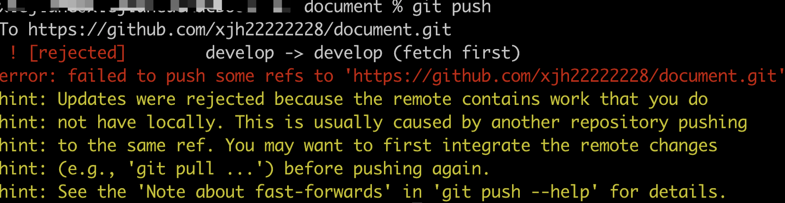
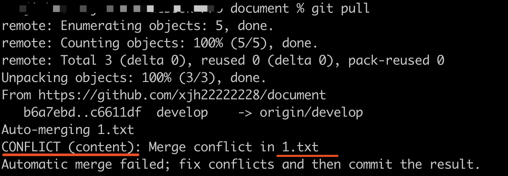
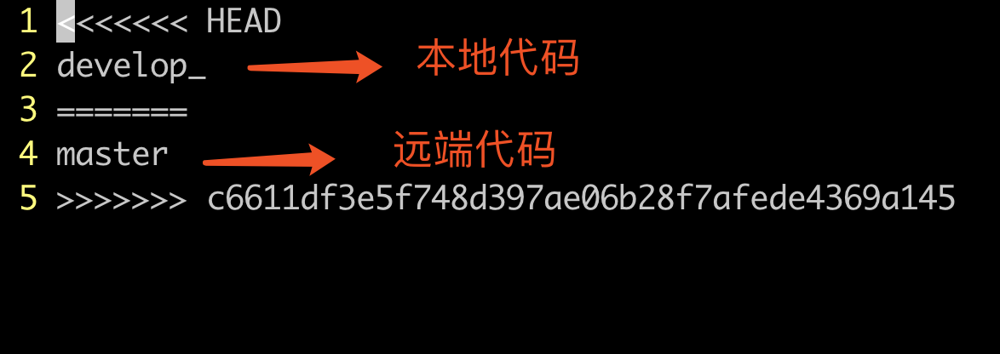
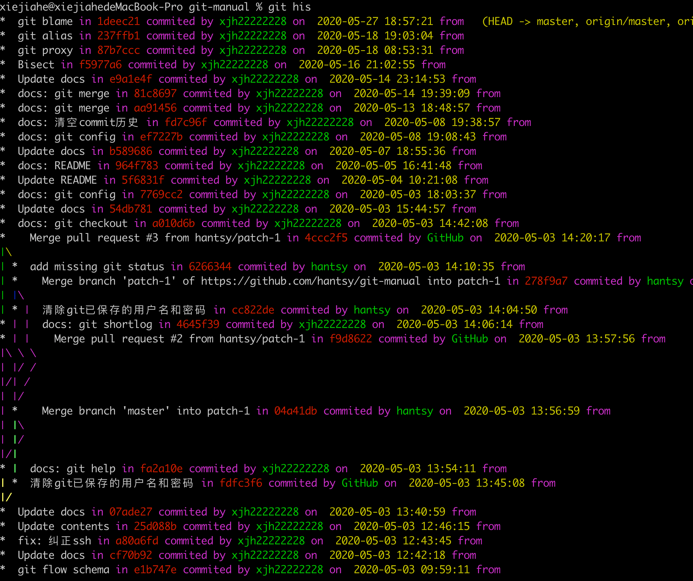
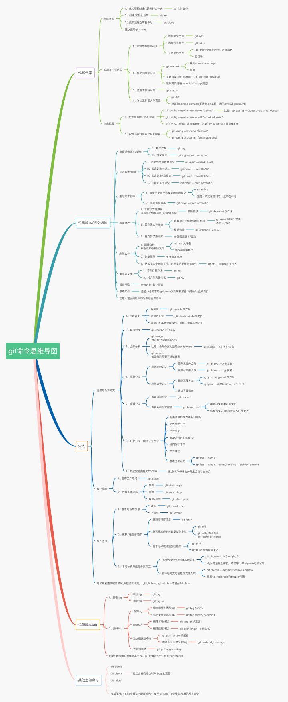

# Git常用命令参考手册   [git-repo](https://github.com/xjh22222228/git-manual) [](http://hits.dwyl.com/xjh22222228/git-manual)


基本涵盖了在开发中用到的git命令，能满足日常需求，巩固你的git知识。

<p align="center">
  
</p>


---
# 目录
- [配置](#配置)
- [初始化仓库](#初始化仓库)
- [克隆](#克隆)
- [remote](#remote)
- [cherry-pick](#cherry-pick)
- [git-stash](#git-stash)
- [文件状态](#文件状态)
- [日志](#日志)
- [Blame](#Blame)
- [查看分支](#查看分支)
- [切换分支](#切换分支)
- [创建分支](#创建分支)
- [删除分支](#删除分支)
- [重命名分支](#重命名分支)
- [合并](#合并)
- [解决冲突](#解决冲突)
- [暂存](#暂存)
- [删除](#删除)
- [还原](#还原)
- [提交](#提交)
- [推送](#推送)
- [更新](#更新)
- [移动-重命名](#移动-重命名)
- [查看文件改动](#查看文件改动)
- [回滚版本](#回滚版本)
- [撤销](#撤销)
- [标签](#标签)
- [git-rebase](#git-rebase)
- [git-flow](#git-flow)
- [git-submodule](#git-submodule)
- [git-bisect](#git-bisect)
- [git-switch](#git-switch)
- [帮助](#帮助)
- [清空commit历史](#清空commit历史)
- [其他](#其他)
- [奇技淫巧](#奇技淫巧)
- [GUI客户端](#GUI客户端)
- [生成SSHKey](#生成SSHKey)


## 配置
```bash
# 查看全局配置列表
git config --global -l
# 查看局部配置列表
git config --local -l

# 查看已设置的全局用户名/邮箱
git config --global --get user.name
git config --global --get user.email

# 设置全局用户名/邮箱
git config --global user.name "xiejiahe"
git config --global user.email "example@example.com"

# 设置本地当前工作区仓库用户名/邮箱
git config --local user.name "xiejiahe"
git config --local user.email "example@example.com"

# 删除配置
git config --unset --global user.name
git config --unset --global user.email

# 将默认文本编辑器设置为 emacs
git config --global core.editor emacs

# 将默认差异化分析工具设置为 vimdiff
git config --global merge.tool vimdiff

# 编辑当前仓库配置文件
git config -e  # 等价 vi .git/config

# 文件权限的变动也会视为改动, 可通过以下配置忽略文件权限变动
git config core.fileMode false

# 文件大小写设为敏感, git默认是忽略大小写
git config --global core.ignorecase false
```

**命令别名配置**
```bash
# git st 等价于 git status
git config --global alias.st status

# 如果之前添加过，需要添加 --replace-all 进行覆盖
git config --global alias.st status --replace-all

# 执行外部命令, 只要在前面加 ! 即可
git config --global alias.st '!echo hello';
# 可以利用外部命令执行一段复杂的合并代码过程，例如：
git config --global alias.mg '!git checkout develop && git pull && git merge master && git checkout -';

# 删除 st 别名
git config --global --unset alias.st
```


**配置代理**
```bash
# 设置
git config --global https.proxy  http://127.0.0.1:1087
git config --global http.proxy  http://127.0.0.1:1087

# 查看
git config --global --get http.proxy
git config --global --get https.proxy

# 取消代理
git config --global --unset http.proxy
git config --global --unset https.proxy
```


## 初始化仓库
`git init` 创建一个空的Git仓库或重新初始化一个现有的仓库

实际上 `git init` 命令用得不多，通常在网页上进行操作。
```bash
# 会在当前目录生成.git
git init

# 以安静模式创建，只会打印错误或警告信息
git init -q

# 创建一个裸仓库, 通常情况下用不上
git init --bare
```


## 克隆
```bash
# https 协议
git clone https://github.com/xjh22222228/git-manual.git

# SSH协议
git clone git@github.com:xjh22222228/git-manual.git

# 克隆指定分支， -b 指定分支名字，实际上是克隆所有分支并切换到 develop 分支上
git clone -b develop https://github.com/xjh22222228/git-manual.git

# --single-branch 完全只克隆指定分支
git clone -b develop --single-branch https://github.com/xjh22222228/git-manual.git

# 指定克隆后的文件夹名称
git clone https://github.com/xjh22222228/git-manual.git git-study # 如果后面是 . 在当前目录创建

# 递归克隆，如果项目包含子模块就非常有用
git clone --recursive git@github.com:xjh22222228/git-manual.git

# 克隆深度为1, 只克隆指定分支, 历史记录只克隆最后一条, 减少克隆时间
git clone --depth=1 https://github.com/xjh22222228/git-manual.git
```


## remote
`git remote` 命令通常用来管理远程仓库。

```bash
# 查看远程仓库服务器, 一般打印 origin , 这是 Git 给你克隆的仓库服务器的默认名字
# 一般只会显示 origin , 除非你有多个远程仓库地址
git remote

# 指定-v, 查看当前仓库地址
git remote -v

# 添加远程仓库地址 example 是自定义名字
# 添加完后可以通过 git remote 就能看到 example
git remote add example https://github.com/xjh22222228/git-manual.git

# 查看指定远程仓库信息
git remote show example

# 重命名远程仓库
git remote rename oldName newName # git remote rename example simple

# 移除远程仓库
git remote remove example
```


## cherry-pick
检出某次commit提交, 如果当前分支上的某次提交的修改正是当前需要的，那么可以使用此命令进行操作。

需要注意的是提交时必须使用 `git push -f` 强制提交方式。
```bash
# 通常情况执行此命令会产生冲突，需要手动去解决
git cherry-pick <commit_id>

# 保留原有作者信息进行提交
git cherry-pick -x 8f6c26fc122502886bdfd9aa55ecda26a3ccc31d
```


## git-stash
应用场景：假设当前分支某些功能做到一半了, 突然需要切换到其他分支修改Bug, 但是又不想提交（因为切换分支必须把当前工作内容提交，否则无法切换），这个时候 `git stash` 应用场景就来了。

```bash
# 保存当前修改工作区内容
git stash

# 保存时添加注释, 推荐使用此命令
git stash save "修改了#28 Bug"

# 保存包含没有被git追踪的文件
git stash -u

# 查看当前保存列表
git stash list

# 恢复修改工作区内容, 会从 git stash list 移除掉
git stash pop # 恢复最近一次保存内容到工作区, 默认会把暂存区的改动恢复到工作区
git stash pop stash@{1} # 恢复指定 id， 通过 git stash list 可查到
git stash pop --index # 恢复最近一次保存内容到工作区, 但如果是暂存区的内容同样恢复到暂存区

# 与 pop 命令一致, 唯一不同的是不会移除保存列表
git stash apply

# 清空所有保存
git stash clear

# 清空指定 stash id, 如果 drop 后面不指定id清除最近的一次
git stash drop stash@{0}
git stash drop  # 清除最近一次
```


## 文件状态
```bash
# 完整查看文件状态
git status

# 以短格式给出输出
git status -s

# 忽略子模块
git status --ignore-submodules

# 显示已忽略的文件
git status --ignored
```

## 日志
查看历史日志可以通过 `git log` / `git shortlog` , 这2个命令非常强大。

```bash
# 查看完整历史提交记录
git log

# 查看前N次提交记录 commit message
git log -2

# 查看前N次提交记录，包括diff
git log -p -2

# 从 commit 进行搜索, 可以指定 -i 忽略大小写
git log -i --grep="fix: #28"

# 从工作目录搜索包含 alert(1) 这段代码何时引入
git log -S "alert(1)"

# 查看指定作者历史记录
git log --author=xjh22222228

# 查看某个文件的历史提交记录
git log README.md

# 只显示合并日志
git log --merges

# 以图形查看日志记录, --oneline 可选
git log --graph --oneline

# 列出提交者代码贡献数量, 打印作者和贡献数量
git shortlog -sn

# 以提交贡献数量排序并打印出message
git shortlog -n

# 采用邮箱格式化的方式进行查看贡献度
git shortlog -e
```


## Blame
`git blame` 意思是责怪，你懂的。

`git blame` 用于查看某个文件的修改历史记录是哪个作者进行了改动。
```bash
# 查看 README.md 文件的修改历史记录，包括时间、作者以及内容
git blame README.md

# 查看谁改动了 README.md 文件的 11行-12行
git blame -L 11,12 README.md
git blame -L 11 README.md   # 查看第11行以后

# 显示完整的 hash 值
git blame -l README.md

# 显示修改的行数
git blame -n README.md

# 显示作者邮箱
git blame -e README.md

# 对参数进行一个组合查询
git blame -enl -L 11 README.md
```


## 查看分支
```bash
# 查看所有分支
git branch -a

# 查看本地分支
git branch

# 查看远端分支
git branch -r

# 查看本地分支所关联的远程分支
git branch -vv

# 查看本地 master 分支创建时间
git reflog show --date=iso master
```

## 切换分支
```bash
# 2种方法，切换到master分支
git checkout master
git switch master  # git >= 2.23

# 切换上一个分支
git checkout -

# 切换远端分支 (通常是本地没有远端的分支记录才会使用此命令，反之不建议)
git checkout -t origin/dev

# 强制切换, 但是要小心，如果文件未保存修改会直接覆盖掉
git checkout -f master
```

## 创建分支
```bash
# 创建develop本地分支
git branch develop

# 强制创建分支, 不输出任何警告或信息
git branch -f develop

# 创建本地develop分支并切换
git checkout -b develop

# 创建远程分支, 实际上创建本地分支然后推送
git checkout -b develop
git push origin develop

# 创建一个空的分支, 不继承父分支，历史记录是空的，一般至少需要执行4步
git checkout --orphan develop
git rm -rf .  # 这一步可选，如果你真的想创建一个没有任何文件的分支
git add -A && git commit -m "提交" # 添加并提交，否则分支是隐藏的 （执行这一步之前需要注意当前工作区必须保留一个文件，否则无法提交）
git push --set-upstream origin develop # 推送到远程
```


## 删除分支
```bash
# 删除本地分支
git branch -d <branchName>
git branch -D <branchName> # 删除远程分支后，想删除本地分支需要执行 -D 参数

# 删除远程分支
git push origin :<branchName>
git push origin --delete <branch-name>  # >= 1.7.0
```

## 重命名分支
```bash
# 重命名当前分支, 通常情况下需要执行3步
# 1、修改分支名称
# 2、删除远程旧分支
# 3、将重命名分支推送到远程
git branch -m <branchName>
git push origin :old_branch
git push -u origin new_branch


# 重命名指定分支
git branch -m old_branch new_branch
```


----


## 合并
```bash
# 将 feature/v1.0.0 分支代码合并到 develop
git checkout develop
git merge feature/v1.0.0

# 以安静模式合并, 把develop分支合并到当前分支并不输出任何信息
git merge develop -q

# 合并不编辑消息, 跳过交互
git merge develop --no-edit

# 合并分支后不进行提交
git merge develop --no-commit

# 退出合并，恢复到合并之前的状态
git merge --abort
```


## 解决冲突
**代码合并/更新代码** 经常会遇到冲突的情况。

1、按照惯例直接把代码提交到远程, 有几种情况:
- 代码顺利的推送的远程分支 (无需理会)
- 出现冲突, git自动做了合并 (无需理会)
- git发现本地文件在远端做了修改，需要进行 git pull
```bash
git push
```

出现冲突，如图：



2、按照提示执行 `git pull` 拉取代码
```bash
git pull
```

提示有文件存在冲突，如图：




3、编辑冲突文件, 解决冲突需要自己去判断到底要保留远端代码还是本地代码或者两端都保留。




4、这是解决后的代码，保留了本地代码


最后按照惯例，把代码推送到远端即可。


除了使用git命令解决以外, 可以使用一些开发工具自带git进行处理。


另外推荐2个工具专门处理git冲突：

- [meld](http://meld.sourceforge.net/install.html)
- [kdiff3](http://kdiff3.sourceforge.net/)

[这篇文章专门介绍这2个工具如何使用](https://gitguys.com/topics/merging-with-a-gui/)


## 暂存
```bash
# 暂存所有
git add -A

# 暂存某个文件
git add ./README.md

# 暂存当前目录所有改动文件
git add .

# 暂存一系列文件
git add 1.txt 2.txt ...
```

## 删除
git add 的反向操作
```bash
# 删除1.txt 文件
git rm 1.txt

# 删除当前所有文件, 与rm -rf 命令不同的是不会删除 .git 目录
git rm -rf .

# 清除当前工作区缓存，但不会删除文件，通常用于修改文件名不生效问题
git rm -r --cached .
```


## 还原
还原操作通过 `git restore` 命令。

`git restore` 是在 `2.23` 引入的, 是为了分离 `git checkout` / `git reset` 职责。

```bash
# 从暂存区还原到工作区
git restore README.md # 多个文件 git restore README.md README2.md
git restore . # 还原当前全部到工作区

# 从stage中还原到暂存区 (如果还原到工作区还要执行一次 git restore README.md)
git restore --staged README.md

# 撤销当前工作区所有文件修改, 不包括新建文件
git restore --worktree .  # 等价于 git checkout -- .
```


## 提交
```bash
# -m 提交的信息
git commit -m "changes log"

# 只提交某个文件
git commit README.md -m "message"

# 提交并显示diff变化
git commit -v

# 允许提交空消息，通常必须指定 -m 参数
git commit --allow-empty-message

# 重写上一次提交信息，确保当前工作区没有改动
git commit --amend -m "新的提交信息"

# 跳过验证, 如果使用了类似 husky 工具。
git commit --no-verify -m "Example" 
```

## 推送
```bash
# 默认推送当前分支
git push

# 推送内容到主分支
git push -u origin master

# 本地分支推送到远程分支， 本地分支:远程分支
git push origin <branchName>:<branchName>

# 强制推送, --force 缩写
git push -f
```


## 更新
```bash
# 拉取远程分支最新内容到本地并合并
git pull

# 远程分支名:本地分支名
git pull origin master:master

# 如果是要与本地当前分支合并，则冒号后面的<本地分支名>可以不写
git pull origin master
```


## 移动-重命名
`git mv` 命令用来重命名文件或移动文件, 大部分开发者会选择手动进行移动文件, 手动和用 `git mv` 是有区别的。

手动和命令两者的区别（假设`README.md`重命名为`README2.md`）：
- 手动：先删除 `README.md`, 然后创建 `README2.md`, 历史记录无法正常追踪
- `git mv`: 实际上是更新索引，把文件进行重命名, 可以通过历史记录方便检索

`git mv` 和 uninx `mv` 命令很像，如果你熟悉的话。

注意：新创建的文件不支持 `git mv` , 必须先提交。
```bash
# 将 1.txt 重命名为 2.txt
git mv 1.txt 2.txt

# 强制将 1.txt 重命名为 2.txt, 不管2.txt文件存不存在
git mv -f 1.txt 2.txt

# 移动目录也一样
git mv temp temp2
```


## 查看文件改动
`git diff` 命令用于查看文件内容之间差异。

```bash
# 查看所有文件工作区与暂存区的差异
git diff

# 查看指定文件工作区与暂存区差异
git diff README.md

# 查看指定 commit 改动内容
git diff dce06bd

# 对比2个commit之间的差异
git diff e3848eb dce06bd

# 还可以比较2个分支最新提交内容差异, develop分支与master分支
git diff develop master

# 查看某个文件的历史修改记录
git log README.md
git show d68a1ef2407283516e8e4cb675b434505e39dc54 README.md
```


----

## 回滚版本

注：回滚版本是不保存在 `git log` 历史，如果想查看使用 `git reflog`

```bash
# 回滚上一个版本
git reset --hard HEAD^

# 回滚上两个版本
git reset --hard HEAD^^

# 回滚到指定 commit_id ， 通过 git log 查看
git reset --hard 'commit id'
```

----

## 撤销
```bash
# 撤销当前目录下所有文件的改动
git checkout -- .

# 撤销指定文件改动
git checkout -- README.md

# 暂存区回到工作区, 指定 ./README.md 文件从暂存区回到工作区
git reset HEAD ./README.md

# 指定commit回到工作区（前提是未推送到远程仓库）, 需要还原的上一个commit_id
git reset <commit_id>

# 把某个commit_id还原初始状态 （前提是未推送到远程仓库）, 需要还原的上一个commit_id
git reset --hard <commit_id>
```


## 标签
```bash
# 列出本地所有标签
git tag

# 列出远程所有标签
git ls-remote --tags origin

# 按照特定模式查找标签, `*` 模板搜索
git tag -l "v1.0.0*"

# 创建带有附注标签
git tag -a v1.1.0 -m "标签描述"

# 创建轻量标签, 不需要带任何参数
git tag v1.1.0

# 后期打标签, 假设之前忘记打标签了，可以通过git log查看commit id
git log
git tag -a v1.1.0 <commit_id>

# 推送到远程，默认只是本地创建
git push origin v1.1.0

# 一次性推送所有标签到远程
git push origin --tags

# 删除标签, 你需要再次运行 git push origin v1.1.0 才能删除远程标签
git tag -d v1.1.0

# 删除远程标签
git push origin --delete v1.1.0

# 检查标签
git checkout v1.1.0

# 查看本地某个标签详细信息
git show v1.1.0
```


## git-rebase
`git rebase` 主要作用可以将多个commit记录合并为一条
```bash
# 操作最近4次提交
git rebase -i HEAD~4
# 或者以 commit_id 进行操作
git rebase -i e88835de905ad396f61a0dc8c040a8ac8a34f3f8


# 放弃 git rebase 操作
git rebase --abort

# 此命令主要用于解决冲突后继续执行
git rebase --continue
```

参考：[git rebase将多次commit合并为一条](https://www.xiejiahe.com/blog/detail/5d550e8553d11b2c3ca05cbe)


## git-flow
`git flow` 不是内置命令，需要单独安装

**初始化** 每个仓库都必须初始化一次
```bash
# 通常直接回车以完成默认设置
git flow init
```

**功能**
```bash
# 开启新的功能
git flow feature start v1.1.0

# 推送到远程, 在团队协作中这一步少不了
git flow feature publish v1.1.0

# 完成功能, 会将当前分支合并到 develop 然后删除分支，回到 develop
git flow feature finish v1.1.0
```


**打补丁**

hotfix是针对 `master` 进行打补丁的
```bash
# 开启新的 hotfix
git flow hotfix start v1.1.0_hotifx

# 推送到远程
git flow hotfix publish v1.1.0_hotifx

# 完成新的hotfix, 将当前分支合并到 master 和 develop，然后删除分支，回到 develop
git flow hotfix finish v1.1.0_hotifx
```

**发布**
```bash
# 开启新的 release
git flow release start v1.1.0

# 推送到远程
git flow release publish v1.1.0

# 完成, 将当前分支合并到 master 和 develop，删除当前分支然后回到 develop
git flow release finish v1.1.0
```

参考：
- [https://www.atlassian.com/git/tutorials/comparing-workflows/gitflow-workflow](https://www.atlassian.com/git/tutorials/comparing-workflows/gitflow-workflow)
- [https://www.git-tower.com/learn/git/ebook/cn/command-line/advanced-topics/git-flow](https://www.git-tower.com/learn/git/ebook/cn/command-line/advanced-topics/git-flow)


#### Git flow schema


---


## git-submodule
`git submodule` 的作用类似于包管理，类似 `npm` / `maven` , 但比包管理使用起来更方便。

```bash
# 添加子模块
git submodule add https://github.com/xjh22222228/git-manual.git
git submodule add https://github.com/xjh22222228/git-manual.git submodules/git-manual  # 添加到指定目录

# -b 添加指定分支
git submodule add -b develop https://github.com/xjh22222228/git-manual.git

# 更新子模块，有2种方法
# 1、Git 会尝试更新所有子模块, 如果有多个子模块可以在 --remote 后指定要更新的子模块名称
git submodule update --remote
# 2、或者进入到子模块项目再拉取
git pull

# 修复子模块分支指向 detached head
git submodule foreach -q --recursive 'git checkout $(git config -f $toplevel/.gitmodules submodule.$name.branch || echo master)'

# 删除子模块， common 为子模块名称，一般删除需要三步
git submodule deinit <common>
git rm --cached common # 清除子模块缓存
git commit -am "Remove a submodule" && git push # 提交代码并推送
```

具体使用还可以看这里 [git submodule子模块使用教程](https://www.xiejiahe.com/blog/detail/5dbceefc0bb52b1c88c30853)


## git-bisect
`git bisect` 二分查找, 用于定位引入Bug的commit，主要4个命令。

此命令非常实用, 如果你的Bug不知道是哪个 commit 引起的，可以尝试此方法。

```bash
# 开始
git bisect start [终点] [起点] # 通过 git log 确定起点和终点
git bisect start HEAD 4d83cf

# 记录这次的commit是好的
git bisect good

# 记录这次的commit是坏的
git bisect bad

# 退出
git bisect reset
```

参考 [https://github.com/bradleyboy/bisectercise](https://github.com/bradleyboy/bisectercise)


## git-switch
`git switch` 命令在git版本 `2.23` 引入, 用于切换分支。

`git checkout` 同样可以切换分支, `git switch` 意义在哪里？ 因为 `git checkout` 不但可以切换分支还可以撤销工作，导致命令含糊不清，所以引入了 `git switch`。

注：由于生态原因, 大部分还是会使用 `git checkout`。
```bash
# 切换到 develop 分支
git switch develop

# 切换到上一个分支
git switch -

# 创建分支并切换
git switch -c newBranch

# 从前3次提交进行创建新的分支
git switch -c newBranch HEAD〜3 
```


## 帮助
```bash
# 详细打印所有git命令
git help

# 打印所有git命令, 此命令不会有详细信息，更清晰一些
git help -a

# 列出所有可配置的变量
git help -c
```


## 清空commit历史
清空 `commit` 有2种方法。

1、第一种方法原理是通过新建新的分支，假设当前分支是 `develop`
```bash
# 1、新建一个新分支
git checkout --orphan new_branch
# 2、暂存所有文件并提交
git add -A && git commit -m "First commit"
# 3、删除本地 develop 分支
git branch -D develop
# 4、再将 new_branch 分支重命名为 develop
git branch -m develop
# 5、强制将 develop 分支推送到远程
git push -f origin develop
```


2、第二种方法通过更新 `引用`, 假设要重设 `master` 分支
```bash
# 通过 git log 找到第一个 commit_id
git update-ref refs/heads/master 9c3a31e68aa63641c7377f549edc01095a44c079

# 接着可以提交
git add .
git commit -m "第一个提交"
git push -f # 注意一定要强制推送
```

这2种方法都是用于清空 commit 历史， 不会造成当前文件的丢失，所以放心。

笔者推荐使用第二种方法，更安全可靠。


## 其他
```bash
# 查看git版本
git --version

# 记住提交账号密码
git config --global credential.helper store

# 清除git已保存的用户名和密码
git credential-manager uninstall # windows
git config --global credential.helper "" # mac linux
git config --global --unset credential.helper # 或者 mac linux

# 清除本地git缓存
git rm -r --cached .

# 列出没有被 .gitignore 忽略的文件列表
git ls-files
```


## 奇技淫巧
**美化 `git log`, 直逼GUI**
```bash
# 1、全局配置
git config --global alias.lg "log --color --graph --pretty=format:'%Cred%h%Creset -%C(yellow)%d%Creset %s %Cgreen(%cr) %C(bold blue)<%an>%Creset' --abbrev-commit"
# 2、输入下面命令, 日志变得非常直观化
git lg

# 这里另外提供几种模式, 可以选择喜欢的一种进行别名配置
git config --global alias.lg "log --graph --pretty=format:'%Cred%h - %Cgreen[%an]%Creset -%C(yellow)%d%Creset %s %C(yellow)<%cr>%Creset' --abbrev-commit --date=relative"

git config --global alias.his "log --graph --decorate --oneline --pretty=format:'%Creset %s %C(magenta)in %Cred%h %C(magenta)commited by %Cgreen%cn %C(magenta)on %C(yellow) %cd %C(magenta)from %Creset %C(yellow)%d' --abbrev-commit --date=format:'%Y-%m-%d %H:%M:%S'"

git config --global alias.hist "log --graph --decorate --oneline --pretty=format:'%Cred%h - %C(bold white) %s %Creset %C(yellow)%d  %C(cyan) <%cd> %Creset %Cgreen(%cn)' --abbrev-commit --date=format:'%Y-%m-%d %H:%M:%S'"
```
效果图




## GUI客户端
推荐几款比较好用的 git 图形界面工具, 不分先后。

- [Github Desktop](https://desktop.github.com/)
- [git-fork](https://git-fork.com/)
- [tower](https://www.git-tower.com/)
- [Sourcetree](https://www.sourcetreeapp.com/)
- [tortoiseGit](https://tortoisegit.org/)
- [gitkraken](https://www.gitkraken.com/)
- [smartgit](https://www.syntevo.com/smartgit/)
- [gitup](https://gitup.co/)
- [lazygit](https://github.com/jesseduffield/lazygit)


## 生成SSHKey
1、替换为您的GitHub电子邮件地址
```bash
ssh-keygen -t rsa -b 4096 -C "your_email@example.com"
```

2、当提示“输入要在其中保存密钥的文件”时，按Enter。接受默认文件位置。 (建议修改名字，防止以后被覆盖)
```
> Enter a file in which to save the key (/Users/you/.ssh/id_rsa): [Press enter]
```

3、在提示符下，键入一个安全密码, 默认回车即可
```bash
> Enter passphrase (empty for no passphrase): [Type a passphrase]
> Enter same passphrase again: [Type passphrase again]
```

4、生成的SSH Key 添加到 `ssh config` 中
```bash
vim ~/.ssh/config

# 粘贴
Host *
  AddKeysToAgent yes
  UseKeychain yes
  IdentityFile ~/.ssh/id_rsa
```

最后将公钥添加到 [https://github.com/settings/keys](https://github.com/settings/keys) 中
```
cat ~/.ssh/id_rsa.pub
```


## 思维导图




## License
MIT


[⬆ 回顶部](#)

